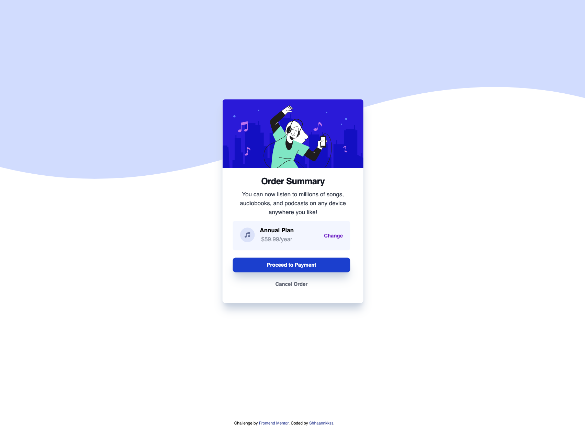

# Frontend Mentor - Order summary card solution

This is a solution to the [Order summary card challenge on Frontend Mentor](https://www.frontendmentor.io/challenges/order-summary-component-QlPmajDUj). Frontend Mentor challenges help you improve your coding skills by building realistic projects.

## Table of contents

- [Overview](#overview)
  - [The challenge](#the-challenge)
  - [Screenshot](#screenshot)
  - [Links](#links)
- [My process](#my-process)
  - [Built with](#built-with)
  - [What I learned](#what-i-learned)
  - [Continued development](#continued-development)
  - [Useful resources](#useful-resources)
- [Author](#author)
- [Acknowledgments](#acknowledgments)

**Note: Delete this note and update the table of contents based on what sections you keep.**

## Overview

### The challenge

Users should be able to:

- See hover states for interactive elements

### Screenshot




### Links

- Solution URL: [Add solution URL here](https://your-solution-url.com)
- Live Site URL: [Add live site URL here](https://your-live-site-url.com)

## My process

I have no specific process, I started coding a month ago so I use Frontend Mentor challenges to help me learn more and faster.

### Built with

- Semantic HTML5 markup
- CSS custom properties
- Flexbox
- [Tailwind](https://tailwindcss.com/) - CSS framework
- [FLowbite](https://flowbite.com/) - Tailwind free library

**Note: These are just examples. Delete this note and replace the list above with your own choices**

### What I learned

I learned more about the dark mode. I didn't care about that aspect before, so it took me some extra hours to design everything again to have two distinct visuals for the day and night.

To see how you can design the dark mode in Tailwind, see below:

```html
<!-- just simply add "dark:" in the, in this exemple the font color will turn blue while in dark mode. -->
<h1 class="dark:text-blue-500">Some HTML code I'm proud of</h1>
```

### Continued development

I need to work on flex boxes (unbelievable, right?) sometimes I get it, and sometimes I don't. I think I need to be more aware of parent/child behavior.

### Useful resources

- [Example resource 1](https://flowbite.com/) - This is a free library for Tailwind. This helped me build the whole container/box faster with a strong customizable base.

- [Example resource 2](https://flowbite.com/tools/tailwind-cheat-sheet/) - This helped me to be much faster with shortcuts. I will look for more cheat sheets to speed up my workflow.

- [Example resource 3](https://chat.openai.com/) - Since I'm new to coding (and self-educated so far), it helped me to structure my questions to get the exact answer I was looking for. I used it only once to get the "change" button in the correct position.

## Author

- Frontend Mentor - [@yourusername](https://www.frontendmentor.io/profile/Shhaannkkss)
- Twitter - [@KamKabu](https://twitter.com/KamKabu)
